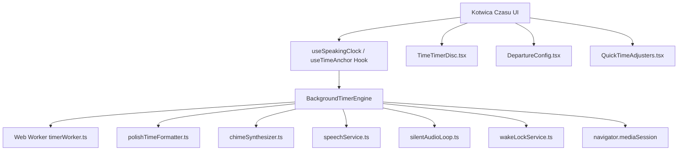

# Specyfikacja Techniczna: Moduł „Kotwica Czasu” (Time Anchor)

**Data utworzenia:** 2026-08-27  
**Status:** Zaakceptowana koncepcja  
**Projekt:** Narzędziownik Ani (`ann-toolbox`)  
**Moduł:** `time-anchor` (wcześniej `speaking-clock`)

---

## 1. Cel i Tło Psychologiczne (ADHD UX)

Dla osób z ADHD pojęcie czasu jest abstrakcyjne i ulotne (*time blindness*). Najtrudniejszymi momentami dnia są:
1. **Utrata orientacji w czasie** podczas pracy/zajęć domowych (pomaga mówiący zegar w tle).
2. **Stres i paraliż przed wyjściem / deadlinem** — nieumiejętność oszacowania, ile minut zostało do wyjścia z domu, pociągu czy spotkania.
3. **Przeciążenie cyfrowymi zegarami** — cyfry wymagają kalkulacji w głowie, podczas gdy kolorowy znikający dysk (*Time Timer*) jest przetwarzany natychmiastowo przez korę wzrokową.

**„Kotwica Czasu”** integruje trzy uzupełniające się mechanizmy:
1. **Tryb Ciągły:** Dyskretny mówiący zegar w zadanym interwale (np. co 5, 10, 15 minut).
2. **Tryb Focus:** Odliczanie określonego bloku czasu (np. 25 min) z łagodnym wybijaniem rytmu.
3. **Tryb Wyjścia / Do Godziny (`departure`):** Odliczanie do konkretnej godziny (np. 08:30 Wyjście z domu) z automatycznym zagęszczaniem komunikatów głosowych w miarę zbliżania się do celu.
4. **Wizualny Dysk Time Timer:** Znikający barwny sektor kołowy na tarczy zegara.

---

## 2. Architektura i Przepływ Danych

---

## 3. Szczegółowe Wymagania Funkcjonalne

### 3.1. Tryby Pracy (`ClockMode`)
- `'continuous'`: Co zadany interwał (np. 5 min) wygłasza aktualny czas w wybranym stylu.
- `'focus'`: Odlicza zadany czas sesji (np. 25 min) od startu do 0.
- `'departure'`: Odlicza od bieżącej chwili do zadanej godziny docelowej (np. 08:30) z przypisaną etykietą zdarzenia.

### 3.2. Inteligentne Zagęszczanie Komunikatów w Trybie Wyjścia (`smartDensity`)
- Pozostało **> 15 minut**: Komunikat co 15 minut (lub co 10 minut zależnie od ustawień).
- Pozostało **5 – 15 minut**: Komunikat co 5 minut (*„Za 10 minut: Wyjście z domu”*, *„Za 5 minut: Wyjście z domu”*).
- Pozostało **< 5 minut**: Komunikat co minutę (*„Za 4 minuty...”*, *„Za 3 minuty...”*, *„Za 2 minuty...”*, *„Za minutę: Wyjście z domu”*).
- Pozostało **0 minut**: Podwójny miękki chime + *„Czas na: Wyjście z domu! Jest godzina 08:30.”*.

### 3.3. Szybkie Dostosowanie Czasu w Locie (`QuickTimeAdjusters`)
Dostępne pigułki podczas aktywnego odliczania:
- `+1 min`, `+5 min`, `+10 min`, `-5 min`
- W trybie `departure`: przesuwa godzinę docelową (np. z 08:30 na 08:35 jednym kliknięciem).
- W trybie `focus`: wydłuża/skraca czas sesji bez utraty dotychczasowego postępu.

### 3.4. Wizualny Dysk Time Timer (`TimeTimerDisc`)
- Rysowanie sektora kołowego w SVG (kąt od $0^\circ$ do $360^\circ$).
- Ruch zgodny lub przeciwny do wskazówek zegara (domyślnie przeciwny do wskazówek zegara, wzorzec oryginalnego Time Timer).
- Paleta kolorów:
  - *Szałwiowy Spokój* (`#4A6B5D`)
  - *Ciepły Bursztyn* (`#D97706`)
  - *Lawendowy Relaks* (`#7C3AED`)
  - *Kojący Koral* (`#E11D48`)
  - *Oceaniczny Błękit* (`#0284C7`)
- Opcjonalne cyfry na tarczy i wskaźnik minutowy.

### 3.5. Polska Fleksja i Gramatyka (`polishTimeFormatter.ts`)
Nowe funkcje:
- `formatDepartureAnnouncement(remainingSeconds: number, label: string, targetTime?: Date, isDone?: boolean): string`
  - Poprawna deklinacja: *1 minuta* $\rightarrow$ *„Za minutę”*, *2, 3, 4 minuty* $\rightarrow$ *„Za {n} minuty”*, *5-21 minut* $\rightarrow$ *„Za {n} minut”*.
  - Opcjonalne dołączenie aktualnego czasu: *„Za 15 minut: Wyjście z domu. Jest 08:15.”*.

---

## 4. Architektura Plików i Modułów

### Zmiany i Nowe Pliki:
1. `src/core/types.ts` & `src/core/registry.ts`:
   - Zmiana nazwy na **„Kotwica Czasu”**, zaktualizowany opis i badge.
2. `src/modules/speaking-clock/types.ts`:
   - Dodanie typu `DepartureSettings`, `TimeTimerSettings`, `TimeTimerColor`, rozszerzenie `ClockMode`.
3. `src/modules/speaking-clock/services/polishTimeFormatter.ts`:
   - Implementacja `formatDepartureAnnouncement` i testy jednostkowe.
4. `src/modules/speaking-clock/services/backgroundTimerEngine.ts`:
   - Rozszerzenie o logikę `departure`, `addMinutes`, obliczanie milestonów i synchronizację MediaSession.
5. `src/modules/speaking-clock/components/TimeTimerDisc.tsx`:
   - Nowy komponent znikającego dysku Time Timer.
6. `src/modules/speaking-clock/components/ModeTabs.tsx`:
   - Nowy komponent przełączania trybów (`continuous`, `focus`, `departure`).
7. `src/modules/speaking-clock/components/DepartureConfig.tsx`:
   - Nowy panel konfiguracji godziny docelowej, etykiet i szybkich tagów.
8. `src/modules/speaking-clock/components/QuickTimeAdjusters.tsx`:
   - Komponent szybkich przycisków dodawania/odejmowania minut na żywo.
9. `src/modules/speaking-clock/components/ClockSettingsModal.tsx`:
   - Dodanie ustawień Time Timer (kolor, kierunek, podziałka).
10. `src/modules/speaking-clock/SpeakingClockModule.tsx`:
    - Integracja nowych komponentów w spójny, kojący widok.

---

## 5. Plan Testów i Zapewnienia Jakości

1. **Testy jednostkowe fleksji gramatycznej:**
   - 0s, 30s, 60s, 120s, 300s, 600s, 900s, 3600s dla różnych etykiet.
2. **Testy jednostkowe silnika w tle (`backgroundTimerEngine.test.ts`):**
   - Inicjalizacja trybu `departure` z godziną docelową.
   - Prawidłowe wyzwalanie komunikatów na milestonach zagęszczania (15m, 10m, 5m, 1m, 0m).
   - Działanie metody `addMinutes` (+5 min, -5 min).
3. **Testy komponentów React (`SpeakingClockModule.test.tsx`, `TimeTimerDisc.test.tsx`):**
   - Przełączanie między 3 trybami.
   - Renderowanie dysku Time Timer i zmiana jego promienia/kąta.
   - Szybkie dodawanie minut i aktualizacja stanu.
4. **Weryfikacja w przeglądarce i build produkcyjny (`npm run build`).**
